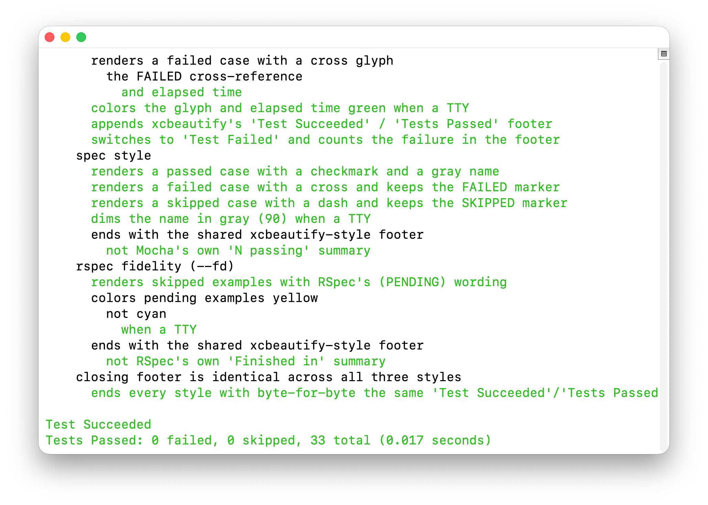

# xctidy

[](Package.swift)
[](LICENSE)

<!-- CI and release badges land here once a GitHub Actions workflow and a tagged release exist. -->



**`xctidy` turns flat, comma-joined `xcodebuild test` output for
[Quick](https://github.com/Quick/Quick)/[Nimble](https://github.com/Quick/Nimble)
suites into a readable, nested `describe`/`context`/`it` tree.**

It reads `xcodebuild`'s raw output directly -- the same protocol xcbeautify
and xcpretty both parse -- so it's a formatter in its own right, not a
post-processor chained after either of them.

## Why xctidy instead of xcbeautify or xcpretty?

xcbeautify and xcpretty are general-purpose `xcodebuild` beautifiers: they
format build output as well as test output, run on Linux, emit JUnit
reports, and integrate with CI UIs (GitHub Actions, TeamCity, Azure DevOps).
`xctidy` does none of that. It does one thing they don't: turn a
Quick/Nimble test's comma-flattened XCTest name back into a real nested
tree, and fold a failure's reason and `file:line` into its own section by
reading `xcodebuild`'s raw `error:` line directly -- something no
post-processor can do once another formatter has already reshuffled that
text (see [docs/HOW_IT_WORKS.md](docs/HOW_IT_WORKS.md#failure-folding)).

**Reach for `xctidy` when:**

- your tests are Quick/Nimble `describe`/`context`/`it` specs (not Swift
  Testing's `@Test`/`@Suite`, not plain `XCTestCase`)
- you want RSpec- or Mocha-style nested, indented test output instead of one
  flat list of comma-joined names
- you want failures pulled out of the tree into their own section, with
  `file:line` preserved

**Keep xcbeautify/xcpretty (or run them alongside `xctidy`) when:**

- you need build-phase output formatted rather than suppressed --
  `xctidy` throws away everything that isn't a test result
- you're on Linux, need JUnit XML, or want the GitHub Actions/TeamCity/Azure
  DevOps renderers -- `xctidy` has none of that
- your tests aren't Quick/Nimble -- there's no comma-flattening problem to
  solve, so `xctidy` adds nothing over what you already have

Both read the same raw `xcodebuild` protocol, so they slot into the same
pipeline position. If you want xcbeautify's build-phase formatting *and*
`xctidy`'s test tree, run `xcodebuild build` through xcbeautify and
`xcodebuild test` through `xctidy` separately -- don't chain them on the
same invocation.

## Features

- [x] Disambiguates Quick/Nimble's comma-flattened XCTest names back into a
  real nested tree
- [x] Folds a failing test's reason and `file:line` into a dedicated
  `Failures:` section, from `xcodebuild`'s raw output directly
- [x] Three familiar output conventions -- `--classic`, RSpec's `-fd`,
  Mocha's `spec` -- pick with a flag
- [x] Drop-in `xcodebuild_formatter` for fastlane's `scan`/`gym`/`snapshot`;
  no xcbeautify/xcpretty install required
- [x] Written in Swift: compiles to a static binary, no Ruby/Node dependency
  added to your pipeline
- [ ] Swift Testing's `@Test`/`@Suite` macro syntax -- not yet, see
  [Known limitations](docs/HOW_IT_WORKS.md#known-limitations)
- [ ] Parallel-testing dedup (`-parallel-testing-enabled`) -- not yet, see
  [Known limitations](docs/HOW_IT_WORKS.md#known-limitations)

## Installation

### Build from source

```bash
git clone https://github.com/woodie/xctidy.git
cd xctidy
swift build -c release
cp .build/release/xctidy /usr/local/bin/
```

## Usage

```bash
xcodebuild test [flags] | xctidy Tests
```

If you want `xctidy` to exit with the same status code as `xcodebuild` (e.g.
on CI):

```bash
set -o pipefail && xcodebuild test [flags] | xctidy Tests
```

```bash
swift test 2>&1 | xctidy Tests
```

The positional argument (`Tests` above) is the path to your specs
directory -- it's how `xctidy` cross-references `describe`/`context`/`it`
string literals to disambiguate comma-flattened names. Omit it and `xctidy`
falls back to a heuristic that handles most cases, but a known spec
directory is more reliable.

### fastlane

`scan` (and `gym`/`snapshot`) already hand this exact pipeline slot to
xcbeautify/xcpretty via the `xcodebuild_formatter` option -- swap the value,
no new stage needed:

```ruby
# Fastfile
lane :test do
  scan(
    scheme: "MyApp",
    xcodebuild_formatter: "/usr/local/bin/xctidy --fd Tests"
  )
end
```

## Output styles

Three named styles, each matching a convention from some other test runner
you've probably already seen:

| Flag | Short form | Convention | Look |
|---|---|---|---|
| `--classic` (default) | -- | this project's own original Python formatter | glyph + `name (N seconds)`, failures add `(FAILED - N)` |
| `--fd` | `-fd` | RSpec's `-fd`/documentation formatter | plain colored name, yellow `(PENDING)` for skips |
| `--spec` | `-fs` | Mocha's default `spec` reporter / Jest | green `✔` + gray name, red `✗ name (FAILED - N)` |

All three end with the exact same closing footer, byte-for-byte, lifted
from real xcbeautify: a green `Test Succeeded`/red `Test Failed` headline,
then `Tests Passed: X failed, Y skipped, Z total (N seconds)`. `--fd` and
`--spec` only change how the tree above that footer looks (RSpec's/Mocha's
own native run summary isn't printed on top of it) -- one shared, unambiguous
ending regardless of style.

Each style is also reachable through `--format <name>` (`documentation`,
`spec`, `classic`) or, for the two non-default styles, its short form --
the `-f<letter>` idiom RSpec itself uses, since `rspec -fd` is really `-f`
(`--format`) immediately followed by the formatter's single-letter code,
not a dedicated two-letter flag. Classic has no short form -- it's already
what you get with no flag at all, so a `-fc` that just reproduced default
behavior would only confuse people about what it's for. `--style <name>`
(with `fd` in place of `documentation`) still works too -- pick whichever
reads best in your pipeline.

The GIF above cycles through all three, in order: `--classic` (no flag),
`--spec` (`-fs`), `--fd` (`-fd`) -- real `swift test` output from this
project's own `EngineSpec.swift` suite, piped through each style. Full text
samples of all three: [docs/HOW_IT_WORKS.md](docs/HOW_IT_WORKS.md#output-styles).

## Development

```bash
swift build
swift test
```

See [docs/DEVELOPMENT.md](docs/DEVELOPMENT.md) for project layout, how to
add a render style, and the release process. See
[docs/HOW_IT_WORKS.md](docs/HOW_IT_WORKS.md) for how the comma
disambiguation and failure folding actually work, and for known limitations.

## Contributing

Please send a PR! [docs/DEVELOPMENT.md](docs/DEVELOPMENT.md) covers getting
set up.

## License

MIT, see [LICENSE](LICENSE).
